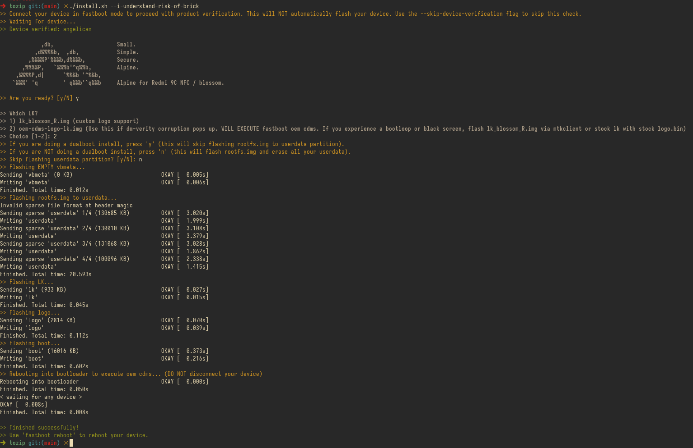

# Установка

> [!CAUTION]
> **ПОЖАЛУЙСТА, ПРОЧИТАЙТЕ ЭТУ ИНСТРУКЦИЮ МЕДЛЕННО, ВНИМАТЕЛЬНО И ПОЛНОСТЬЮ ОТ НАЧАЛА ДО КОНЦА!! ПРЕЖДЕ ЧЕМ НАЧИНАТЬ, УБЕДИТЕСЬ, ЧТО ВЫ ПОЛНОСТЬЮ ПОНЯЛИ КАЖДЫЙ ШАГ, КАЖДОЕ ПРИМЕЧАНИЕ И ВСЕ ИНСТРУКЦИИ!! НЕ ПРОПУСКАЙТЕ НИ ОДНУ ЧАСТЬ ЭТОГО РУКОВОДСТВА, ПОСКОЛЬКУ ЭТО МОЖЕТ ПРИВЕСТИ К ОШИБКАМ ИЛИ НЕПРЕДВИДЕННЫМ ПРОБЛЕМАМ В ДАЛЬНЕЙШЕМ!!**

> [!WARNING]
> * **Сделайте резервную копию (бэкап) всех важных данных** с вашего устройства перед началом установки.
> * **Убедитесь, что у вас есть доступ к средствам раскирпичивания/перепрошивки** (таким как SP Flash Tool или `mtkclient`), а также скачанная стоковая прошивка на случай хардбрика.
## Подготовка

1. Установите MIUI 12.5 на телефон.

2. Установите `ADB` и `Fastboot` на хост-машине:
   ```sh
   pacman -S android-tools # arch/arch based
   emerge dev-util/android-tools # gentoo
   apt install adb fastboot # debian/debian based
   # ... в других дистрибутивах ищите пакеты вроде `android-tools`, `adb` и `fastboot`
   ```

3. Проверьте версии:
   ```sh
   fastboot --version
   adb --version
   ```

4. Убедитесь, что Ваш пользователь состоит в группе `plugdev`:
   ```sh
   groups
   ```
   Если нет, добавьте пользователя в эту группу и заново войдите в систему:
   ```sh
   usermod -aG plugdev $USER
   ```

5. Убедитесь, что устройство заряжено как минимум на 25%.

## Установка

Скачайте последний архив со страницы [**Releases**](https://github.com/99-blossom/alpican/releases/latest).

Распакуйте архив. Внутри должны быть файлы: `boot.img`, `logo_redmi_alpine.bin`, `rootfs.img`, `vbmeta.img`, `oem-cdms-logo-lk.img`, `lk_blossom_R.img` и скрипт установки `install.sh`.

1. Подключите устройство к компьютеру в режиме `fastboot`. Проверьте, видит ли его компьютер, командой:
   ```sh
   fastboot devices
   ```
   Вывод должен выглядеть примерно так:
   ```sh
   1234567890ABCBD         fastboot
   ```

2. Запустите скрипт установки:
   ```sh
   ./install.sh
   ```
   Если получите ошибку `Permission denied`, дайте скрипту права на выполнение и запустите его снова:
   ```sh
   chmod +x install.sh
   ./install.sh
   ```

3. Следуйте инструкциям в скрипте:
   <details>
   <summary>(+)</summary>
   <p align="center">
      <br>
      
   </p>
   </details>
   <br>
> [!NOTE]
> Если выбран `oem-cdms-logo-lk.img`, идентификатор хоста может отображаться как **MT6762G**. Это ожидаемое поведение и не влияет на работу системы.
>
> [Это происходит потому, что данный LK от прошивки Redmi 10A (MIUI 12.5.4.0 RCZCNXM) и использует платформенный идентификатор MT6762G, а не кодовое имя устройства.](https://4pda.to/forum/index.php?act=findpost&pid=139550809&anchor=Spoil-139550809-2)

> [!TIP]
> Если вы прошили `rootfs.img` в раздел `userdata` и система видит только ~500 МБ места (исходный размер образа), расширьте файловую систему на весь размер раздела с помощью утилиты `resize2fs` из пакета `e2fsprogs-extra`:
> ```sh
> apk add e2fsprogs e2fsprogs-extra
> 
> resize2fs /dev/mmcblk0p41
> ```

## Пароли
* **root:** 1