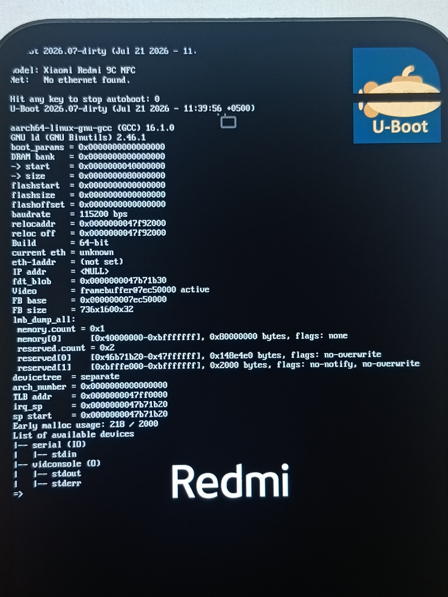
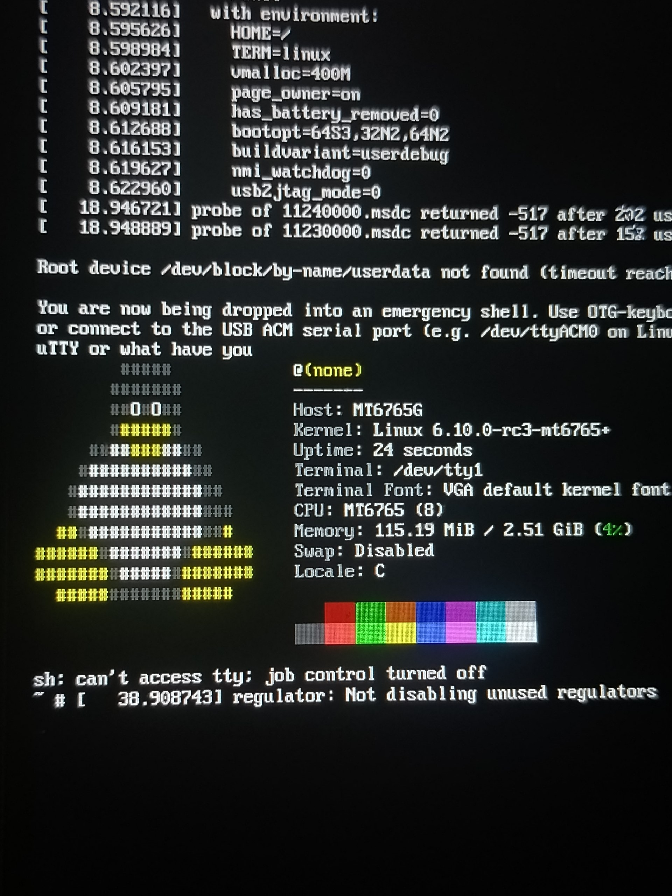
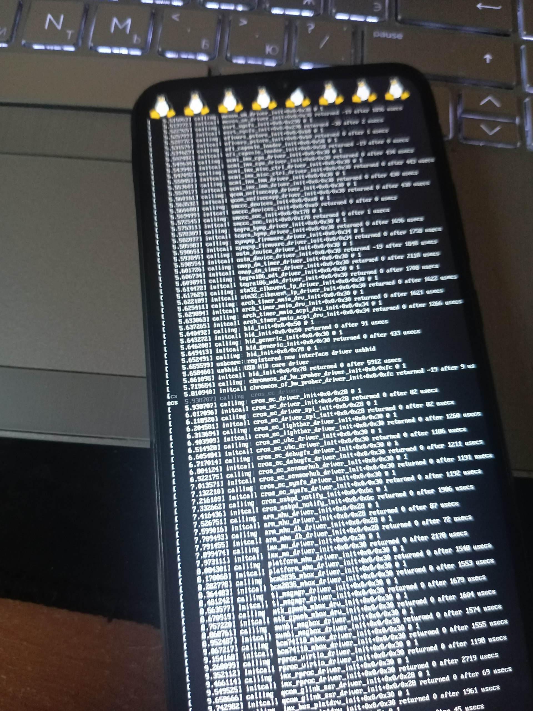
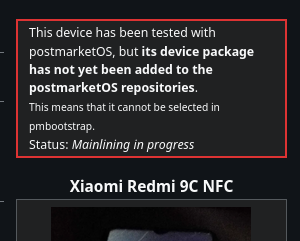

## Mainline / U-Boot
[← Back to README](../README.md)

Early bring-up efforts to run a mainline Linux kernel.

### U-Boot
U-Boot boots via a shim:
```
brom -> Preloader -> LK -> boot.img -> (shim -> U-Boot) -> Linux / Android etc.
```
U-Boot can chainload both Linux and Android:

<p>
  
</p>
<!--- u-boot щас такой типо я покажу тебе что такое ловис --->

### Mainline Kernel
Managed to boot both **6.10.0-rc3** (w/o U-Boot) and **7.2.0-rc4** (w/ U-Boot).

* **6.10.0-rc3** - display output, boot and `/init` execution work.

<figure style="display: inline-block; text-align: center; margin: 10px;">
  
  <figcaption>6.10.0-rc3 in emergency shell</figcaption>
</figure>

---
* **7.2.0-rc4** - same as above, but `/init` execution is very buggy.

<figure style="display: inline-block; text-align: center; margin: 10px;">
  
  <figcaption>7.2.0-rc4 with initcall_debug</figcaption>
</figure>


### pmOS moment
<p>
  
</p>