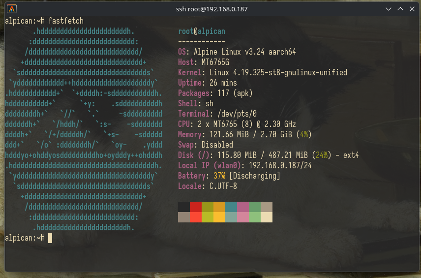
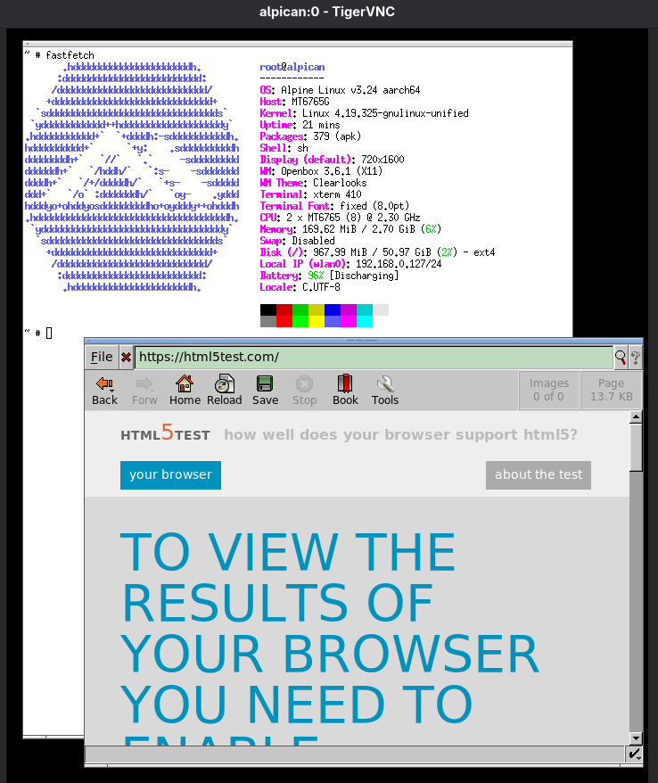
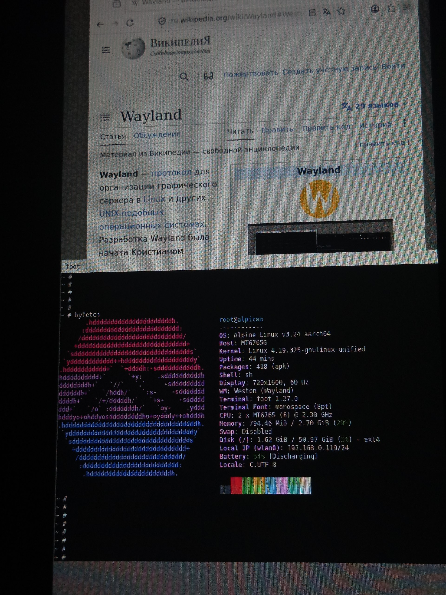
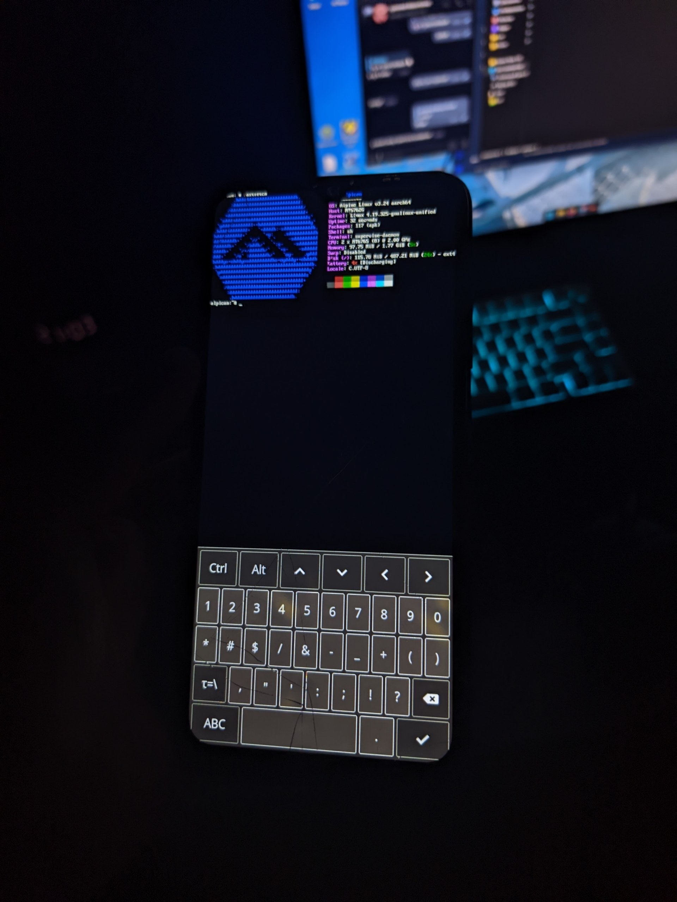

 
 

  

<h2 align="center">Alpican (OSS & R Vendor)</h2>

Alpine Linux port for Redmi 9C / NFC

> [!WARNING]  
> I am **NOT** responsible for **any** damage to your device, including but **NOT** limited to bricking, hardware failure, software malfunction, data loss, security issues, loss of warranty, or **any** other negative consequences that _may_ occur. **You are solely responsible** for any actions you take and any modifications you apply.
> <!--- ⬆⬆⬆⬆⬆ omfg  what a shame ^w^ ⬆⬆⬆⬆⬆ --->
>
> Proceed **only** if you fully understand what you are doing and accept all associated risks. If not, please leave this page!

> [!NOTE]
> I am currently ~~moving~~ this device toward [U-Boot](https://u-boot-project.org/) and a mainline Linux kernel, but for now Alpican is **still** using a downstream 4.19 kernel without U-Boot.
>
> * [🇬🇧 Mainline / U-Boot progress](Docs/mainline.md)
> * [Kernel sources (downstream 4.19)](https://github.com/99-blossom/kernel_xiaomi_blossom_gnulinux)
> * [Kernel sources used to bring-up 6.10](https://github.com/evilMyQueen/linux-mt6765)
> * [Kernel sources (7.2, mainline)](https://github.com/torvalds/linux)

## Changelog
* **Alpican version:** v4.1 (based on Alpine v3.24, aarch64);
* [🇬🇧 Changelog EN](Docs/ch/en.md)
* [🇷🇺 Changelog RU](Docs/ch/ru.md)

## Images

  
  <figure style="margin: 0;">
    
  </figure>

  <figure style="margin: 0;">
    
  </figure>

  <figure style="margin: 0;">
    
  </figure>

  <figure style="margin: 0;">
    
  </figure>

  <figure style="margin: 0;">
    
  </figure>

---

📸 [all screenshots](Docs/allimg/un.md)

## Why
This project **aims** to bring a minimal, fast, and highly customizable `Alpine Linux` environment to devices based on the MediaTek Helio G35/G25 (blossom platform), with the **Redmi 9C NFC** as the *primary* target. The **goal** is to move beyond heavily modified Android userlands and explore a clean, _Unix-like_ system on mobile hardware.

Alpine was chosen because of its simplicity, small footprint, and flexibility. It provides a lightweight base system that can be easily adapted for embedded devices and experimental ports. Unlike traditional Android-based distributions, Alpine gives full control over the system without unnecessary services or background overhead.

If you find any bugs, please [open an issue](https://github.com/99-blossom/alpican/issues) or reach out in any way you can. I _may_ be slow to respond, as I work on projects in my free time.
### Other blossom devices?

Officially, **Alpican** supports only the **Redmi 9C NFC**. However, it is absolutely possible to run it on other devices from the `blossom` family as well (thanks to **VildanG** for proving this). For example, **Redmi 9A**:

(+)

     
    

 

> [!NOTE]
> On the **Redmi 9A**, the fingerprint-related configuration had to be disabled because the device does not have a fingerprint sensor. Leaving it enabled caused a **NULL pointer dereference**.
## Guides
* [🇬🇧 Install EN](Docs/ins/en.md)
* [🇷🇺 Install RU](Docs/ins/ru.md)

## Status
> [!IMPORTANT]
> Features not listed here have not been tested or confirmed to work. Statuses marked as **Untested** or **Broken** are not functional or verified yet.

| Feature | Status | Notes |
| :--- | :---: | :--- |
| **Flashing** |  |  |
| **Booting** |  | `OpenRC`, `systemd`, `runit` (all work, but **OpenRC** is used)
 |
| **Storage** |  | Internal (**eMMC**), external (**MicroSD** cards) |
| **Display** |  | Framebuffer (`mtkfb`, `/dev/fb0`), console output, brightness control |
| **Console** |  | `agetty`, `tty`, `sh`/`bash`, cursor visibility |
| **Wi-Fi** |  | `wpa_supplicant`, `dhcpcd` (**wlan0**, **ap0**, **p2p0**) |
| **Bluetooth** |  | |
| **NFC** |  | `/dev/sec-nfc` exists |
| **GPS** |  | |
| **Battery** |  | Charging status and percentage tracking |
| **SSH** |  | `openssh` |
| **Pkg manager**|  | `apk` |
| **USB Gadget** |  | Serial console (`/dev/ttyGS0` via ACM) |
| **Inputs** |  | Touchscreen (`buffyboard`), **OTG** keyboard |
| **Audio** |  | `aplay` tested, `alsamixer` config required |
| **Virtualization** |  | `qemu-system-aarch64`, `qemu-system-x86_64` (`/dev/kvm` exists) |
| **X11** |  | `X.Org`, `xorg-server`, `xf86-video-fbdev`, `x11vnc` (basically any X11 WM/DE) |
| **Wayland** |  | `fbdev-backend`, Weston (10.0.5, `fbdev-backend.so`, **!> 11**) |
| **Misc**|  | Flashlight, Vibration motor |
| **Camera** |  ||
| **Calls** |  | |
| **Cellular Data** |  | ccci/smem init fail|
| **SMS** |  |  |
| **Fingerprint** |  | |
| **Sensors** |  | `m_*_misc` sensors |
| **Hardware Accel.**|  |  |
## In plans
* (Close to) **Mainline** Linux kernel support;
  - **DRM/KMS** support (or a compatible `/dev/dri/card0` interface);
  - Hardware-accelerated graphics;
  - Wayland support with DRM/KMS backend

## Acknowledgments

* **[Sakurajima](https://github.com/Sakurajima07)**- kernel source base (since v2.0)
* **[postmarketOS](https://postmarketos.org)**
* **dropout**, **[Xerrorain](https://4pda.to/forum/index.php?showuser=11705487)** - `lk_blossom_R.img`, `oem-cdms-logo-lk.img`
* **[VildanG](https://github.com/vildangil)** - Redmi 9A tests
* **[kiberrrxx](https://github.com/kiberrrxx)**
* **[LineXin](https://github.com/LineXin)**, **[MrGadget84](https://4pda.to/forum/index.php?showuser=11986529)**, **[predefine](http://github.com/predefine)**

## Liked it?
* **KISS**
* ... and if you find this project useful or interesting, please consider leaving a ⭐ **star**!