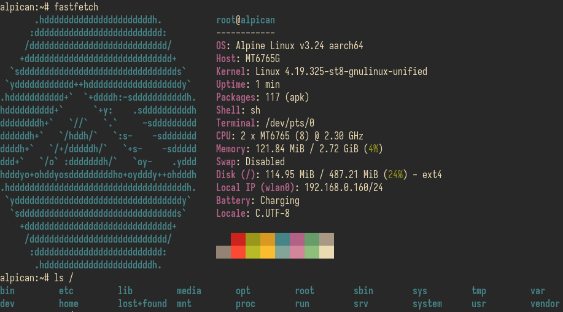
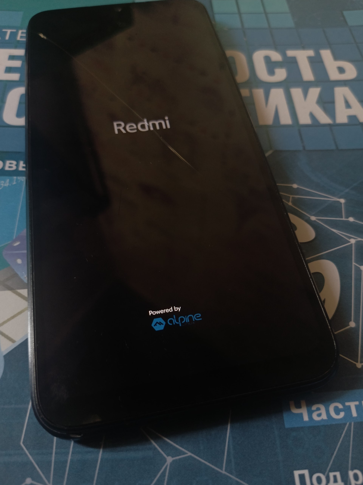
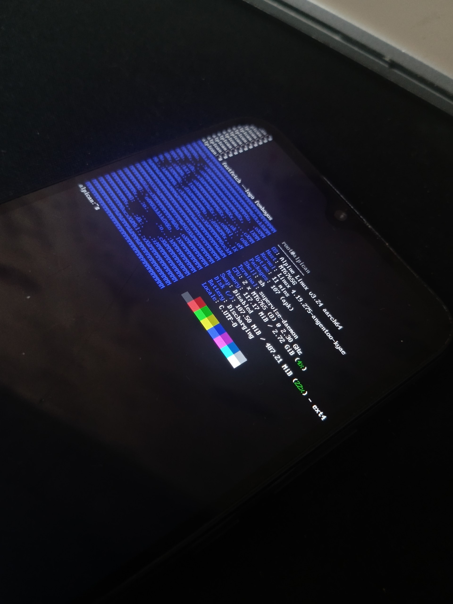
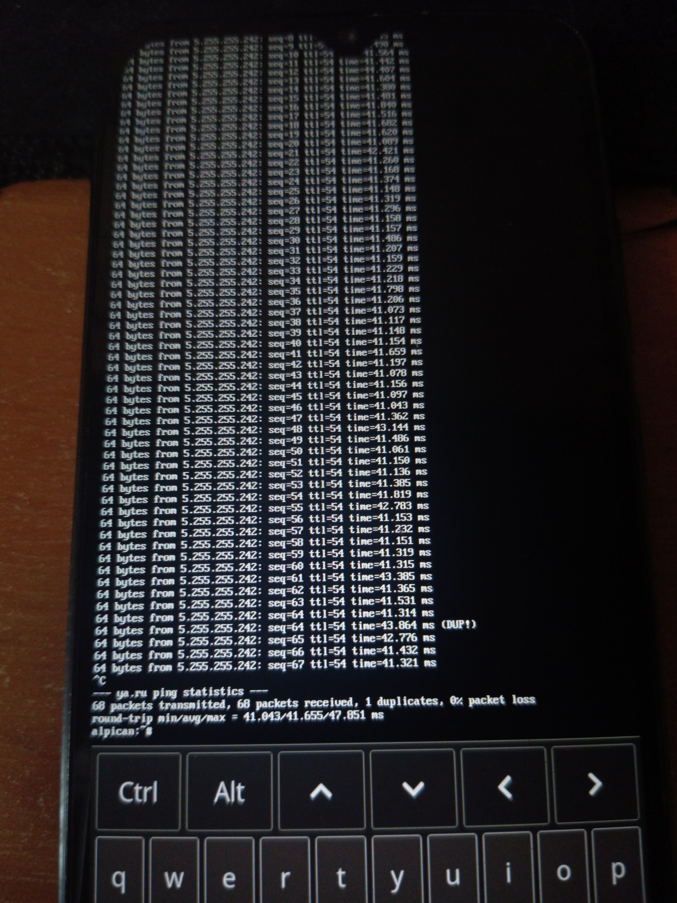
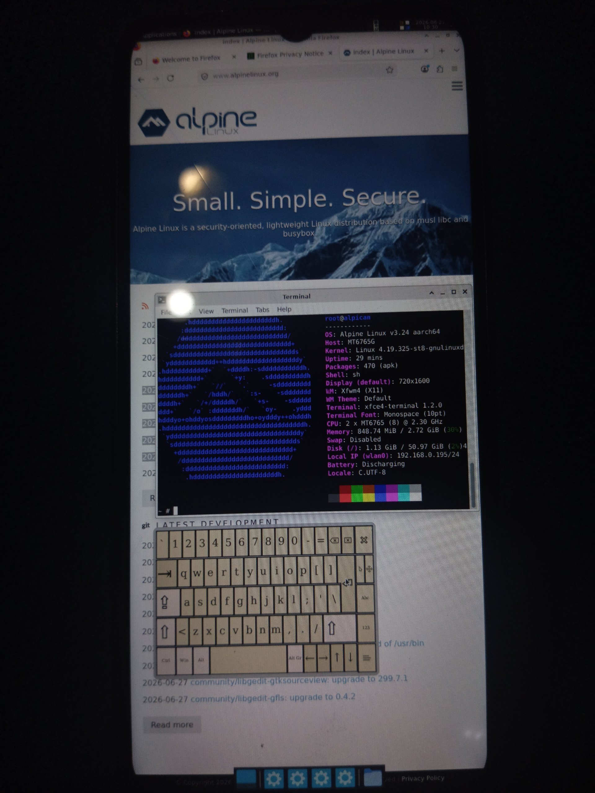

 

  

<h2 align="center">Alpican (11 / R)</h2>

Alpine Linux port for Redmi 9C NFC: Again.

## Changelog
* Alpine version: v3.24 aarch64
* [🇬🇧 Changelog EN](ch/en.md)

## Images
   

## Why
This project **aims** to bring a minimal, fast, and highly customizable `Alpine Linux` environment to the Redmi 9C NFC (MediaTek Helio G35) device. **The goal** is to move beyond heavily modified Android userlands and explore a clean, _Unix-like_ system on mobile hardware.

Alpine was chosen because of its simplicity, small footprint, and flexibility. It provides a lightweight base system that can be easily adapted for embedded devices and experimental ports. Unlike traditional Android-based distributions, Alpine gives full control over the system without unnecessary services or background overhead.

It also serves as a potential alternative to my previous project [angentoo](https://github.com/xewvvi/angentoo), as Alpican currently has a smaller number of known bugs and a more stable base for experimentation.

If you find any bugs, please let me know and I will try to fix them.

## Guides
* [🇬🇧 Install EN](ins/en.md)
* [🇷🇺 Install RU](ins/ru.md)

## What works
* Booting (`OpenRC` as init-system),
* Wi-Fi (`wpa_supplicant, dhcpcd`),
* SSH (`openssh`),
* `apk` package manager,
* `agetty, tty, sh/bash`,
* Touchscreen (`buffyboard`),
* X11 (`X.Org, xorg-server, xf86-video-fbdev`) (not bundled by default),
* X11 DE's (confirmed working): XFCE4 (`xfce4-session`, `xfce4-panel`, `xfwm4`)

## Liked it?
* Also try [angentoo](https://github.com/xewvvi/angentoo)!
* **KISS.**